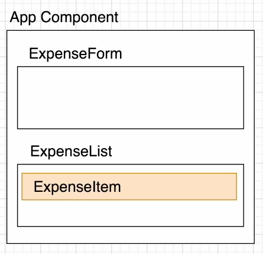

## 9-1 React JS 기초
예산 계산기 앱을 만들면서 리액트와 관련된 기초적인 개념을 학습.

---
## 목차

[1. 리액트 앱 설치 및 실행하기](#1-리액트-앱-설치-및-실행하기)

[2. 리액트 앱 구조](#2-리액트-앱-구조)

[3. SPA](#3-spasingle-page-application)

[4. JSX](#4-jsxjavascript-syntax-extension)

[5. 계산기 실습](#5-예산-계산기-앱-만들어보기)

[6. Props](#6-props를-통한-컴포넌트-간-데이터-전달)

[7. React State](#7-react-state란)


---

### 1. 리액트 앱 설치 및 실행하기
- 리액트 앱을 설치하게 되면 자동으로 webpack과 babel 등이 설치되어 우리가 기본적으로 설정해야되는 부분이 간편화되어 있다.
- 설치는 `npx create-react-app ./` 을 통해 현재 폴더 위치에 설치할 수 있다.
- 실행을 위해서는 package.json에 있는 내용을 참조해서 `npm run start`를 활용하면 된다.

---

### 2. 리액트 앱 구조
- 리액트 앱의 2가지 파일의 이름은 수정되어서는 안된다.
    - `public/index.html` 은 페이지 템플릿.
    - `src/index.js` 는 자바스크립트의 시작점이다.
- js와 css는 src에 내부에서 작성해야 하며, webpack은 src 폴더만 처리하기 때문에 이외는 안됨.
- 현재 index.js에서 잡아준 `root` 요소를 통해 App.js의 내용을 작성한다.

---

### 3. SPA(Single Page Application)
- 예전에는 각각의 페이지를 다 따로 만드는 MPA 방식이었지만, 요즘은 전체 페이지를 하나의 페이지에 담아 동적으로 화면을 바꿔가며 표현하는 SPA 방식을 선호하며 많이 사용한다.
- SPA는 HTML5의 History API를 이용해서 현재 페이지 내에서 화면 이동이 일어난 것처럼 작동하게 만들어줌.

---

### 4. JSX(Javascript syntax extension)
- 말 그대로 JS의 확장 문법으로 리액트에서는 이 JSX를 이용해 화면에 UI가 보이는 모습을 표현한다.
    - ex : `const simple = <h1>Hello World</h1>;`
- 의무는 아니지만 UI작업 시 편리하기 때문에 거의 대부분 리액트에서는 JSX를 사용.

<details>
    <summary><b>JSX 사용 시 주의점</b></summary>
<br/>

- JSX는 컴포넌트에 여러 엘리먼트 요소가 있으면 반드시 하나의 부모 요소로 감싸야 한다.

```js
// 잘못된 예: 두 개의 최상위 요소
<div>첫 번째 요소</div>
<p>두 번째 요소</p>

// 올바른 예: 하나의 부모 요소로 감쌈
<div>
    <div>첫 번째 요소</div>
    <p>두 번째 요소</p>
</div>

// 올바른 예: 빈 태그 사용
<>
    <div>첫 번째 요소</div>
    <p>두 번째 요소</p>
</>
```

- JavaScript 표현식을 사용할 때는 중괄호 {}를 사용합니다. 


```js
const name = "홍길동";
const formatName = (user) => {
  return user.firstName + ' ' + user.lastName;
}
const user = {firstName: "고", lastName: "길동"};

<div>안녕하세요, {name}님!</div>
<div>반갑습니다, {formatName(user)}님!</div>
```

- HTML 속성 이름은 카멜 케이스(camelCase)로 작성해야 합니다.

```js
// 잘못된 예
<div class="my-class"></div>

// 올바른 예
<div className="my-class"></div>
<div tabIndex="0"></div>
```


- 모든 태그는 닫혀 있어야 합니다. HTML과 달리, JSX에서는 모든 태그가 닫혀 있어야 합니다. 빈 태그의 경우에도 `<br />, `와 같이 슬래시 /를 사용하여 닫아주어야 합니다.

```js
// 잘못된 예
<input type="text">


// 올바른 예
<input type="text" />

```

</details>

---

### 5. 예산 계산기 앱 만들어보기
- src 내부에 components 폴더를 생성해서 각각의 컴포넌트 생성.



<details>
    <summary>각각 코드는 참조</summary>

- ExpenseList, ExpenseForm, ExpenseItem

```js   

// ExpenseForm

import React, { Component } from 'react'
import "./ExpenseForm.css";
import { MdSend } from 'react-icons/md';

export class ExpenseForm extends Component {
  render() {
    return (
      <form>
        <div className='form-center'>
            <div className='form-group'>
                <label htmlFor="expense">지출 항목</label>
                <input
                    type='text'
                    className='form-control'
                    id='charge'
                    name='charge'
                    placeholder='예) 렌트비'
                />
            </div>
            <div className='form-group'>
            <label htmlFor="expense">비용</label>
                <input
                    type='number'
                    className='form-control'
                    id='amount'
                    name='amount'
                    placeholder='예) 100'
                />
            </div>
        </div>
        <button type='submit' className="btn">
            제출<MdSend className='btn-icon'/>
        </button>
      </form>
    )
  }
}

export default ExpenseForm

// ExpenseItem

import React, { Component } from 'react'
import './ExpenseItem.css';
import {MdEdit, MdDelete} from 'react-icons/md';

export class ExpenseItem extends Component {
  render() {
    return (
      <li className='item'>
        <div className='info'>
            <span className='expense'></span>
            <span className='amount'> 원</span>
        </div>
        <div>
            <button className='edit-btn'>
                <MdEdit/>
            </button>
            <button className='clear-btn'>
                <MdDelete/>
            </button>
        </div>

      </li>
    )
  }
}

export default ExpenseItem


// ExpenseList

import React, { Component } from 'react';
import './ExpenseList.css';
import ExpenseItem from './ExpenseItem';
import { MdDelete } from 'react-icons/md';

export class ExpenseList extends Component {
  render() {
    return (
      <>
        <ul className='list'>
          <ExpenseItem/>
        </ul>
        <button className='btn'>
          목록 지우기<MdDelete className='btn-icon'/>
        </button>
      </>
    )
  }
}

export default ExpenseList

```

</details>

---

### 6. Props를 통한 컴포넌트 간 데이터 전달
- 임시용 가짜 데이터를 만들어서 부모 컴포넌트에서 자식 컴포넌트로 전달할 때 사용.
- 읽기 전용이기 때문에 자식 컴포넌트 입장에서는 변하지 않고, 부모에서 state를 변경해줘야 바뀜.


```js

initialExpenses = [
    {id : 1, charge: "렌트비", amount:1600},
    {id : 2, charge: "교통비", amount:400},
    {id : 3, charge: "식비", amount:1200}

]

// 하위 컴포넌트에 속성 이름을 정해서 그 값으로 전달
<ExpenseList initialExpenses = {this.initialExpenses}/>


// 하위 컴포넌트에서 아래와 같은 이름으로 받기.
{this.props.initialExpenses.map(expense => {
            return (
              <ExpenseItem expense={expense}
              key={expense.id}/>
            )
})}

```

> key 속성이란?
>> 유니크한 값으로, 가상 돔에서 어떤 부분이 변경됐는지 식별하기 위함으로 필요함.

---

### 7. React State란?
- 컴포넌트의 렌더링 결과물에 실제 영향을 주는 데이터를 갖고 있는 객체를 의미
- 리액트에서 값을 수정하기 위해서는 State 값을 변경해줘야 함.
- `this.setState`를 사용해서 실제 값을 수정

```js
constructor(props){
    super(props);
    this.state = {
      expenses : [
        {id : 1, charge: "렌트비", amount:1600},
        {id : 2, charge: "교통비", amount:400},
        {id : 3, charge: "식비비", amount:1200}
      ]
    }
  }

  
  handleDelete = (id) =>{
    const newExpenses = this.state.expenses.filter(expense => expense.id !== id);

    this.setState({expenses : newExpenses});

  }

```

- `super`에서 props를 전달하는 이유는 Component 객체 생성시 속성 초기화를 위해 전달.
- 생성자 내부에서도 정상적으로 this.props를 사용하기 위해.


---


### 8. React Hook
class 없이 state를 사용할 수 있는 새로운 기능을 의미한다.
react component는 클래스형과 함수형의 차이는 복잡하고 기능이 많은지, 기능은 적지만 간단한지 차이 정도이다.

react hooks가 없을 때는 함수형 컴포넌트에서는 리액트의 생명주기에 따른 개발을 할 수가 없기 때문에 함수형이 더 편해도 클래스형을 쓰게 되었음.